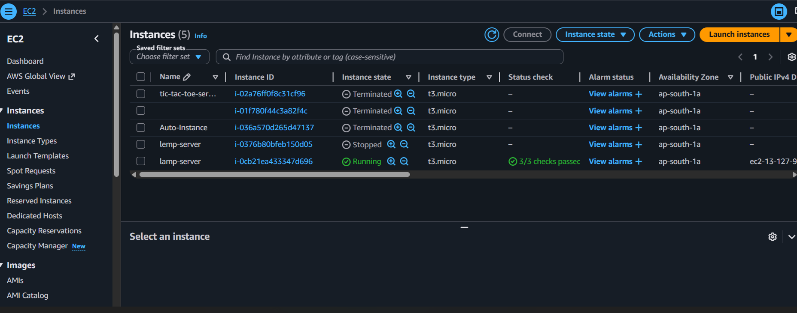

# LAMP-Application-Hosting
Hosted a LAMP stack application on AWS using EC2 and RDS with Linux, Apache, MySQL, and PHP for dynamic web application hosting.

## 🎯 Purpose
Host a traditional web application using the LAMP stack.

## 🧰 AWS Services Used
- Amazon EC2
- Amazon RDS

## 📌 Project Overview
This project demonstrates hosting a LAMP application using Linux, Apache, MySQL, and PHP on AWS infrastructure.

## 🚀 Features
- Apache web hosting
- MySQL database integration
- PHP application support
- Scalable deployment

## 📸 Project Screenshots

### 1. EC2 Instances
This shows the EC2 instance hosting the LAMP application.

### 2. Apache Web Server
This shows the Apache default web page running on the server.

### 3. RDS Database
This shows the MySQL RDS database configuration.

### 4. User Data Configuration
This shows the EC2 user-data script used for application setup.

